# ANDROID ANALYSIS — Reversing & Instrumentation Toolchain


## Higiene del repo

Instalador Bash de toolchain Android para reversing, análisis estático, instrumentación dinámica y captura de tráfico en dispositivos/emuladores de laboratorio autorizados. Conserva seis fases: base, ADB, APK tools, análisis estático, instrumentación dinámica y tráfico. No conecta automáticamente dispositivos ni ejecuta una app objetivo. El repositorio público no contiene credenciales, tokens, configuraciones de engagement, capturas reales, logs ni artefactos generados. Las carpetas `evidence/`, `screenshots/` y `pruebas/` se mantienen fuera del árbol publicado; `tests/` se conserva exclusivamente como control de regresión técnica. Las plantillas y fixtures, cuando existen, usan valores de laboratorio y no conceden autorización.

## Licencia

El código se distribuye bajo **MIT License**. Consulta el archivo `LICENSE` para el texto legal completo. El uso de funciones que envían tráfico, transmiten RF, interactúan con dispositivos, ejecutan módulos o procesan material de autenticación requiere autorización escrita independiente.

## Integración continua

El workflow `.github/workflows/ci.yml` se ejecuta en cada push a `main`, pull request contra `main` o lanzamiento manual desde la pestaña **Actions**. Comprueba sintaxis Bash/Python, ShellCheck, regresiones del instalador, el smoke test de Tkinter bajo Xvfb y la resolución del lockfile Python con hashes. Si todo pasa, construye el paquete Debian, inspecciona su contenido y lo publica como artefacto temporal de Actions durante 14 días.

El workflow no publica releases, no modifica ramas y usa `permissions: contents: read`. El paquete descargable se obtiene desde la ejecución correspondiente de GitHub Actions.

## Estructura

`src/android_toolchain/core.sh` conserva las seis fases y plan JSON; `src/no4nn.sh` resuelve el entrypoint; `tests/` conserva regresiones shell, dry-run y sintaxis de la GUI. El diagrama `assets/operation-flow.png` resume la transición operacional; el banner interno se mantiene en el entrypoint o núcleo de la herramienta.

## Flujo recomendado

El flujo recomendado es ejecutar `--guided` o `--interactive`, elegir `--static-only`, `--dynamic-only` o `all`, generar plan con `--plan-json`, revisar `JADX_SHA256` y solo después instalar. Para estático usa `sudo -E ./src/no4nn.sh --static-only`; para una previsión dinámica usa `./src/no4nn.sh --dry-run --dynamic-only`. ADB no se conecta automáticamente a dispositivos. El operador debe registrar target, ventana, privilegios, dependencias, resultado y procedimiento de cleanup. Un plan, dry-run o diagnóstico no equivale a una ejecución real ni a una vulnerabilidad confirmada.

## Pasos de instalación

Requisitos: Ubuntu, Bash, `sudo` para APT, Python 3, `python3-tk`, Java y conectividad HTTPS. Las fases dinámicas requieren ADB, emulador/dispositivo de laboratorio, Frida/objection y permisos de depuración; la fase de tráfico requiere Wireshark/tcpdump/mitmproxy. El bootstrap instala las herramientas Python para el usuario actual mediante `requirements.lock`, que fija dependencias transitivas y hashes con `--require-hashes`; no crea ni activa `.venv`:
```bash
./install.sh --help
./install.sh --guided
./install.sh --dry-run --static-only --plan-json
# después de revisar el plan
sudo -E ./install.sh --static-only
```
También existe una interfaz gráfica nativa para estaciones con escritorio y Tk disponible:
```bash
./install.sh --gui
```
La GUI empieza en modo **dry-run**, permite seleccionar el alcance, el directorio de herramientas,
el estilo del banner y si se omite APT, muestra la salida en vivo y solicita confirmación antes de
una instalación real. El modo CLI permanece disponible para servidores y automatización.
`--tools-dir` cambia la raíz de instalación. JADX, dex2jar y MobSF están fijados a una versión o commit aprobado y JADX se verifica obligatoriamente con SHA-256. APT, JADX, MobSF, Frida y ADB se preparan solo según la política de la estación. Si una herramienta Python queda en `$HOME/.local/bin`, añade esa ruta al `PATH`.

Punto de entrada principal: `./src/no4nn.sh`. Revisa siempre `--help` y la autorización vigente antes de elegir una operación activa.

### Versión CLI

La interfaz de línea de comandos actual es **v2.1.0**. Se consulta con:

```bash
./install.sh --help
./src/no4nn.sh --help
```

El CLI soporta `--dry-run`, `--plan-json`, `--static-only`, `--dynamic-only`, `--skip-apt`, `--interactive`, `--guided` y `--gui`. La versión también aparece en el banner como `Version 2.1.0`.

## Integración con Ubuntu

El repositorio incluye un icono SVG, un archivo `.desktop` y un paquete Debian versionado. Puedes consultar directamente el [paquete `.deb` v2.1.0](android-analysis-toolchain_2.1.0_all.deb), el [lanzador `.desktop`](packaging/debian/usr/share/applications/android-analysis.desktop), el [icono SVG](packaging/debian/usr/share/icons/hicolor/scalable/apps/android-analysis.svg) y el [script de construcción](packaging/build-deb.sh).

```bash
./packaging/build-deb.sh
sudo apt install ./android-analysis-toolchain_2.1.0_all.deb
```

Consulta [docs/desktop-integration.md](docs/desktop-integration.md) para la estructura, los campos del lanzador y la actualización manual del menú.

## 🐉 Instalación en Kali Linux

Kali Linux usa el mismo formato Debian, por lo que el paquete se puede construir e instalar con el flujo anterior. El paquete incluye una variante de icono en azul inspirada en la identidad visual de Kali, sin incorporar logotipos oficiales de terceros.

```bash
sudo apt update
sudo apt install -y python3-tk android-tools-adb dpkg-dev
./packaging/build-deb.sh
sudo apt install ./android-analysis-toolchain_2.1.0_all.deb
```

El icono fuente está disponible en [`assets/android-analysis-kali.svg`](assets/android-analysis-kali.svg) y se instala en el paquete como `android-analysis.svg`. Después de instalar, busca **Android Analysis** en el menú de Kali o ejecuta `android-analysis` desde una terminal.

```mermaid
flowchart LR
    accTitle: Kali Desktop Packaging Flow
    accDescr: Flujo para construir el paquete Debian, instalar sus dependencias y registrar Android Analysis con su icono azul en el menú de Kali Linux

    source([🏁 Código fuente]) --> build[📦 build-deb.sh]
    build --> package[📦 Paquete Debian]
    package --> deps[🔧 python3-tk + ADB]
    deps --> install[🚀 Instalación con apt]
    install --> menu[🎨 Menú de Kali + icono]

    classDef start fill:#ede9fe,stroke:#7c3aed,stroke-width:2px,color:#3b0764
    classDef process fill:#dbeafe,stroke:#2563eb,stroke-width:2px,color:#1e3a5f
    classDef success fill:#dcfce7,stroke:#16a34a,stroke-width:2px,color:#14532d

    class source start
    class build,package,deps process
    class install,menu success
```



## Guía de ejecución

### 1. Preflight

Ejecuta primero la ayuda y el plan sin cambios:

```bash
./install.sh --help
./install.sh --guided
./install.sh --dry-run --static-only --plan-json
```

El modo `--guided` explica el flujo y termina. `--dry-run` genera el plan sin modificar el host ni descargar herramientas; `--plan-json` permite conservarlo como evidencia local.

### 2. Instalación por alcance

Para análisis estático:

```bash
sudo -E ./install.sh --static-only
```

Para fases dinámicas usa `--dynamic-only` únicamente en una estación autorizada con ADB, emulador o dispositivo de laboratorio, Frida/objection y las herramientas de captura aprobadas. `--skip-apt` evita usar APT en una imagen ya preparada y `--tools-dir PATH` fija el directorio de instalación.

### 3. Verificación y cleanup

Comprueba las versiones, revisa el checksum de JADX mediante `JADX_SHA256`, documenta el dispositivo o emulador utilizado y elimina artefactos temporales al terminar. El instalador no conecta automáticamente dispositivos ni ejecuta aplicaciones objetivo. La licencia MIT y la autorización escrita del laboratorio siguen siendo obligatorias.
